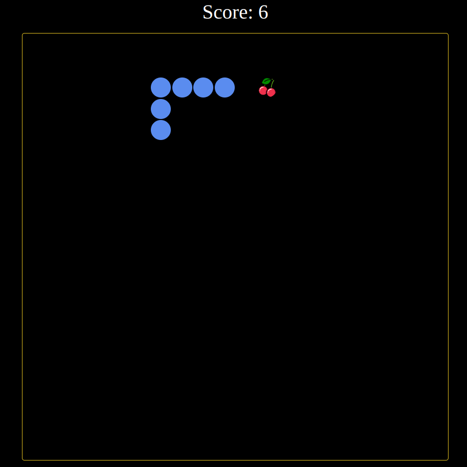

# Snake-Spiel

Dies ist ein einfaches Snake-Spiel, das mit [HTML](https://developer.mozilla.org/en-US/docs/Web/HTML), [CSS](https://developer.mozilla.org/en-US/docs/Web/CSS), und [JavaScript](https://developer.mozilla.org/en-US/docs/Web/JavaScript) erstellt wurde. Das Spiel ist im Browser spielbar und bietet stundenlangen Spaß!



## Spielanleitung

- Bewegen Sie die Schlange mit den Pfeiltasten auf Ihrer Tastatur.
- Ziel des Spiels ist es, so viele Früchte wie möglich zu essen, ohne sich selbst zu beißen oder gegen die Wände zu stoßen.
- Das Spiel endet, wenn die Schlange mit sich selbst kollidiert oder gegen die Wand fährt.
- Ihre Punktzahl wird oben auf dem Bildschirm angezeigt.

## Spiel starten

1. Besuchen Sie die [Live-Demo](https://snake-rouge-psi.vercel.app/), um das Spiel sofort im Browser zu spielen.
2. Wenn Sie das Spiel herunterladen und lokal ausführen möchten, können Sie das Repository klonen und die `index.html`-Datei in einem modernen Webbrowser öffnen:

```bash
git clone https://github.com/Katapluff/Snake.git

```
